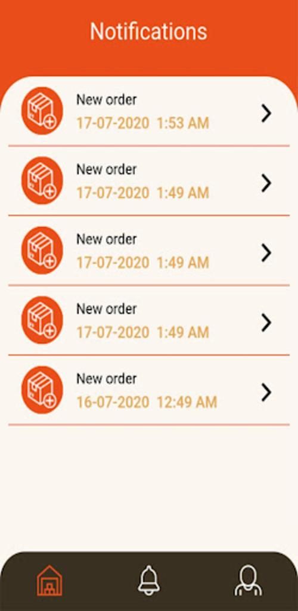
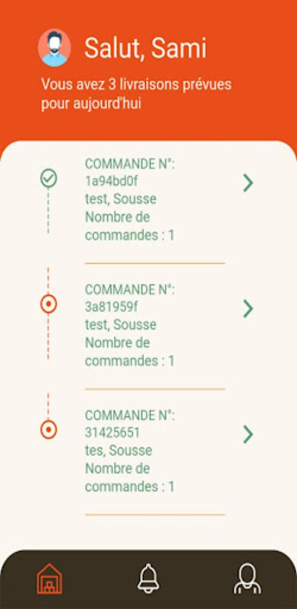
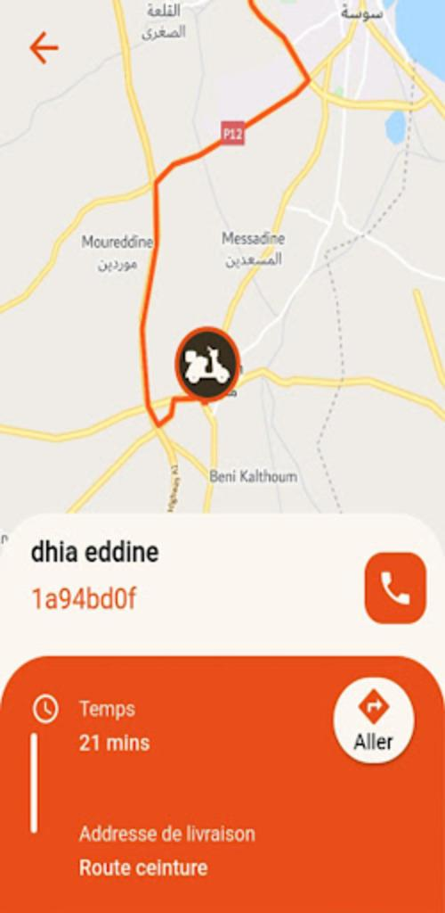

# Venven

Venven is a mobile application developed using Flutter, designed for both Android and iOS platforms. It serves as a dedicated delivery boy application specifically designed for grocery stores. 

With a clean and user-friendly layout, Venven empowers delivery personnel to efficiently manage their delivery tasks. The application leverages the power of Google Maps integration, enabling delivery drivers to locate clients' locations accurately and directly.

The Backend of Venven lies in the Django backend platform, where all the necessary information is stored. The application seamlessly communicates with the backend through an API, ensuring that all relevant data, such as delivery details and customer information, is readily available to the delivery boy within the app.

By utilizing Venven, delivery personnel can optimize their workflow and enhance their productivity. The app simplifies the delivery process by providing a centralized platform for managing and organizing all delivery-related tasks. With the integration of Google Maps, drivers can navigate efficiently, reaching clients' locations with ease.

Overall, Venven offers a practical solution for grocery store delivery personnel, streamlining their operations and enabling efficient delivery management.

Please note that as Venven is a customized application developed for a specific client, sharing the source code may not be feasible due to confidentiality and intellectual property reasons. However, the provided description outlines the key functionalities and features of the application.

## Photos

